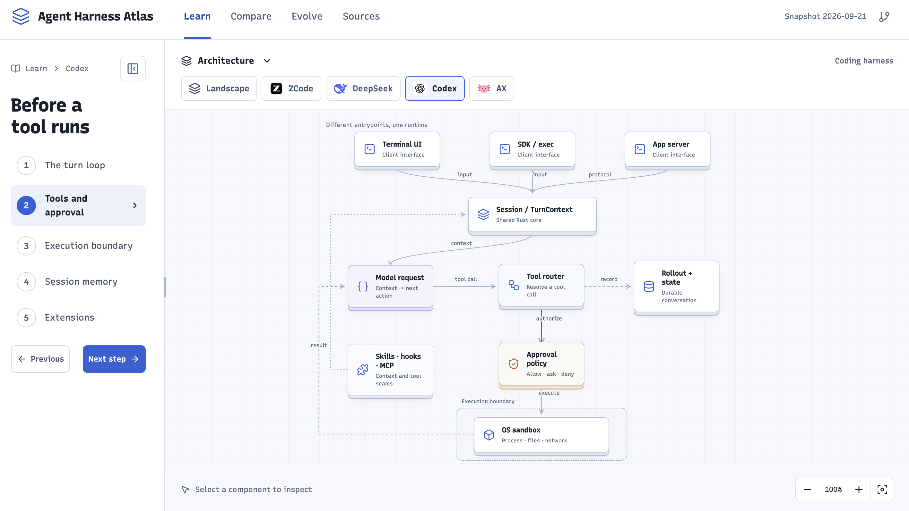

# Agent Harness Atlas

**A visual field guide to the software around an AI agent.** Follow a request through a real harness, inspect the parts that handle it, and open the pinned source for each inspected component.

[Explore the Atlas](https://kenny2077.github.io/Harness-Atlas/) · [Compare the systems](https://kenny2077.github.io/Harness-Atlas/#/compare) · [Browse the source index](https://kenny2077.github.io/Harness-Atlas/#/sources)



## What you can explore

- **Follow the loop.** Move through a guided request, from entry point to model, tool, approval, execution, and result.
- **Inspect a component.** Select a diagram node to see its responsibility, inputs, outputs, and commit-pinned references.
- **Compare implementations.** See how four projects divide the same responsibilities, including their safety boundaries.
- **Trace public history.** Use the evolution view to distinguish current behavior from earlier or removed features.

The diagram supports panning, zooming, keyboard navigation, and a mobile component list. The reading panel can be resized or collapsed without losing the current chapter. The architecture picker starts open and lets you switch systems directly beside the diagram.

## The four systems

| Project | Scope in this Atlas | Start here |
| --- | --- | --- |
| [ZCode](https://github.com/zai-org/ZCode) | A TypeScript coding harness shared by desktop, web, and terminal clients. | [Open the lab](https://kenny2077.github.io/Harness-Atlas/#/learn/zcode) |
| [DeepSeek Harness](https://github.com/deepseek-ai/deepseek-harness) | A harness assembled from profiles, bundles, and a plugin tree. | [Open the lab](https://kenny2077.github.io/Harness-Atlas/#/learn/deepseek) |
| [OpenAI Codex](https://github.com/openai/codex) | A Rust session core connecting clients, tools, policy, and execution. | [Open the lab](https://kenny2077.github.io/Harness-Atlas/#/learn/codex) |
| [Google AX](https://github.com/google/ax) | A v0.3 control plane for task environments around agent processes. | [Open the lab](https://kenny2077.github.io/Harness-Atlas/#/learn/ax) |

AX's placement around the three harnesses is **conceptual**, not a tested integration. The Atlas explains architecture; it does not run the agents or rank their performance.

## Start locally

Requires Node.js 24 and npm.

```sh
git clone https://github.com/kenny2077/Harness-Atlas.git
cd Harness-Atlas
npm ci
npm run dev
```

Open [http://127.0.0.1:5173/Harness-Atlas/](http://127.0.0.1:5173/Harness-Atlas/). Hash routes preserve links to chapters and components on GitHub Pages.

```sh
npm run typecheck
npm test
npx playwright install chromium
npm run test:e2e
npm run build
```

The site is a static React and TypeScript build. It serves its content, artwork, and Recursive variable font locally; it needs no account, API key, analytics service, or runtime API.

## How the evidence works

The current snapshot is dated **2026-09-21**. Upstream revisions are pinned in [`research/upstreams.json`](research/upstreams.json); the site does not silently refresh its research. Claims are marked **implemented**, **documented**, **historical**, or **inferred**. Architectural fit is an interpretation, not a benchmark result.

Public history has limits. ZCode has a two-commit source opening, DeepSeek's imported history begins with existing capabilities, and AX v0.3 removed earlier built-in harness behavior. Similarity and chronology alone do not establish influence.

Read the [research methodology](research/methodology.md), [cross-project findings](research/convergence.md), and [source index](https://kenny2077.github.io/Harness-Atlas/#/sources). The site keeps deeper references in component details and the comparison view so the main diagram stays readable.

## Contributing and refreshing the snapshot

Start with [CONTRIBUTING.md](CONTRIBUTING.md). Factual corrections need a primary source and a clear distinction between observed behavior and interpretation. To refresh the snapshot, pin all four revisions, update the notes in `research/` and records in `src/content/`, then run:

```sh
npm run fetch:upstreams
npm run research:verify
npm run typecheck
npm test
npm run test:e2e
npm run build
```

`fetch:upstreams` creates ignored, blob-filtered clones under `.research/upstreams/`; it does not install or build the upstream projects. GitHub Actions verifies pull requests and publishes passing `main` builds to GitHub Pages.

## License and acknowledgments

Original Atlas code and content are licensed under [Apache-2.0](LICENSE). Upstream excerpts and project marks retain their owners' rights; see [THIRD_PARTY.md](THIRD_PARTY.md) and [NOTICE](NOTICE).

[Brendan Bycroft's LLM Visualization](https://bbycroft.net/llm) inspired the synchronized explanation and system view. This Atlas is an independent educational project, not an official product of the projects it studies.
